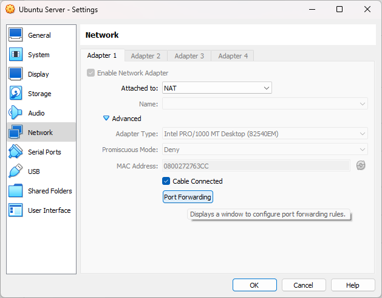

# Cara Install Code Server Di Ubuntu Server VirtualBox

## Pendahuluan

Code Server (code-server) adalah sebuah text editor yang dapat berjalan di server dan diakses melalui web browser.

Ubuntu Server itu sendiri adalah sebuah operating system yang berbasis command line dan biasanya digunakan sebagai server.

Sementara itu, VirtualBox adalah sebuah virtual machine yang dapat menjalankan sistem operasi di dalam sistem operasi.

Code Server sangat berguna jika kita ingin melakukan coding pada sebuah server dengan interface web.

Sebagai contoh kasus, misalnya kita telah menginstall Node.js pada sebuah server.

Kemudian, kita ingin coding Node.js di server tersebut.

Kita bisa melakukannya via web interface dengan Code Server.

Jadi, kita hanya perlu membuka web browser ke alamat server kita dan melakukan coding di sana.

Hal ini lebih mudah ketimbang harus coding via SSH misalnya dengan editor berbasis console seperti VIM atau Nano.

Dalam artikel ini, OS yang menjalankan VirtualBox adalah Windows dan OS VirtualBox nya adalah Ubuntu Server.

## Langkah Peng-Install-An

Untuk meng-install code-server di Ubuntu Server VirtualBox, prasyaratnya adalah:

-   Install VirtualBox.
-   Install Ubuntu Server di VirtualBox, dalam hal ini, saya menggunakan Ubuntu Server versi 22.04.2 LTS.

Kemudian, jalankan perintah ini di terminal Ubuntu Server:

```
sudo apt update
sudo apt upgrade
sudo reboot now
```

Selanjutnya, kembali di terminal Ubuntu Server:

```
curl -fsSL https://code-server.dev/install.sh | sh
```

Tunggu hingga proses install nya selesai

Selanjutnya, buka konfigurasinya:

```
sudo nano ~/.config/code-server/config.yaml
```

Dan ubah isinya menjadi seperti ini:

```
bind-addr: 0.0.0.0:8080
auth: password
password: passwordsaya
cert: false
```

Di konfigurasi di atas, bind-addr di-set 0.0.0.0:8080.

Artinya Code Server bisa diakses dari IP address sumber dari manapun dengan menuju ke port 8080 yang merupakan port dari Code Server itu sendiri.

auth: password berarti metoda loginnya adalah dengan password.

password: passwordsaya adalah password yang digunakan kita untuk login ke Code Server.

Langkah selanjutnya adalah menjalankan code-server dengan perintah ini:

```
code-server
```

Sekarang, buka setting dari VM Ubuntu server dari Windows, kemudian ke tab Network.



Di bagian Adapter 1, klik Port Forwarding dan isi dengan Rule 3 seperti di gambar di bawah ini.


Bedanya, pada Guest IP isi dengan ip address Ubuntu Server kita.

Untuk mengetahui ip address Ubuntu Server Anda, buka SSH dan jalankan:

```
ip address
```

Pilih ip yang bukan 127.0.0.1 dari output perintah tersebut.

Di saya adalah 10.0.2.15.

Untuk Host Port nya itu sendiri adalah 8080. Sesuai dengan bind-addr yang ada di config.yaml.

Anda juga boleh isi Rule 1 dengan Guest IP yang sama jika Anda ingin akses SSH ke Ubuntu Server di VirtualBox Anda. Tapi ingat, ini untuk SSH, BUKAN Code Server.

IP tadi itulah yang dimasukkan ke Rule di gambar tadi.

Nah sekarang kembali ke sisi OS utama Anda, yakni Windows, bukan OS nya VirtualBox.

Sekarang, Anda bisa mengakses code-server dari browser Windows ke:

http://127.0.0.1:8080

Di bagian login code server, gunakan password yang telah Anda tulis tadi di konfigurasi code-server (yang tertulis tadi di contohnya: passwordsaya).

Mungkin di sini kita akan sedikit bingung.

Tadi saya bilang pilih ip address yang bukan 127.0.0.1, tapi sekarang kita mengakses IP tersebut.

Sebenarnya, ini tidak perlu dibingungkan.

Karena Rule 3 tadi sudah menjelaskannya.

IP address 127.0.0.1 yang dibuka pada browser Windows akan di-forward ke 10.0.2.15 di port 8080 dari Ubuntu Server.

127.0.0.1 adalah IP dari Windows.

10.0.2.15 adalah IP dari Ubuntu Server di VirtualBox.

Kalimat “Pilih ip yang bukan 127.0.0.1 dari output perintah tersebut.” tadi cukup membingungkan, bukan?

Maksud dari kalimat tersebut, bahwa Windows dan Ubuntu Server keduanya memiliki IP 127.0.0.1, tapi itu hanya bisa diakses dari masing-masing OS itu sendiri, jadi tidak bisa dari luar.

Maka, saya bilang saat kita ingin mendapatkan IP yang bisa diakses dari luar Ubuntu Server itu bukanlah 127.0.0.1, tapi yang lain.

Dan yang lain itulah yang akan kita masukkan ke Rule 3 di port forwarding VirtualBox. Dalam hal ini 10.0.2.15.

## Penutup

Selamat mencoba code-server.
