# Cara Menggunakan Publii Untuk Blog Gratis

## Blog, apa itu blog?

Istilah blog mungkin sudah sering terdengar beberapa waktu belakangan ini.

Blog adalah website yang berisi postingan atau halaman yang berisi konten.

Biasanya, konten blog berupa tulisan, walaupun memungkinkan juga untuk gambar, infografis, bahkan aplikasi maupun asset lainnya.

## Apakah membuat blog itu gratis?

Pembuatan blog bisa menggunakan layanan gratis maupun berbayar.

Contoh platform blog gratis yang terkenal adalah WordPress.com (bukan yang self hosted) dan Blogger, atau yang biasa disebut Blogspot.

Adapun, contoh platform berbayar yang cukup populer adalah layanan web hosting yang diinstall WordPress self hosted.

Selain itu, ada pula platform blog yang berupa static website seperti GitHub Pages dan Netlify.

## Static website itu apa?

Static website adalah website yang berisi file html statis.

Di sisi client, konten website dibuat, kemudian, setelah dipublikasi, konten tersebut di-generate menjadi kumpulan file html dan asset statis untuk kemudian semuanya di-upload sekaligus ke web server.

Berbeda dengan dynamic website, yang mana, konten diisi di sisi server dan di-update tidak secara sekaligus.

Namun, definisi di atas tidak mencerminkan definisi website statis dan website dinamis sesungguhnya.

Apa yang kami tulis tadi hanyalah penafsiran kami berdasarkan penggunaan platform website statis dan dinamis yang telah kami coba.

## Di manakah static website di-host?

Karena berupa file statis, maka secara teoritis bisa menggunakan web server seperti Apache dan Nginx.

Tapi, ada beberapa layanan di luar sana yang menyediakan layanan website statis, seperti GitHub Pages, Netlify, dan Surge.sh.

## Apakah static website ada CMS-nya?

CMS atau Content Management System untuk static website itu ada.

Contohnya adalah Publii dan Hugo.

Untuk Publii dan Hugo itu sendiri, kita bisa mendapatkannya secara gratis.

Berikut ini adalah link untuk Publii:

https://getpublii.com/

## Saya ingin contoh kasusnya… Adakah?

OK, pada artikel ini, kami akan membahas cara singkat untuk membuat website statis dengan CMS Publii dan di-host di GitHub Pages.

### Langkah-Langkah di Sisi Client

#### Langkah 1

Langkah yang perlu Anda lakukan pertama kali adalah men-download Publii melalui link yang tadi kami berikan.

Selanjutnya, install hingga selesai.

Selanjutnya, jalankan aplikasi Publii.

Isi nama website (Website name) dan nama penulis (Author name).

Pilih icon manapun yang Anda inginkan.

Selanjutnya, klik “Create Website”.

#### Langkah 2

Setelah itu, halaman utama Publii akan terbuka.

Pergilah ke tab “Site settings”, nanti akan muncul tampilan seperti gambar di bawah ini:

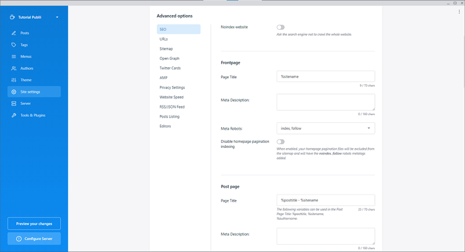

Di tab tersebut ada setting untuk theme dan setting untuk halaman website.

Perhatikan konfigurasi Frontpage.

di “Page Title” tertulis “%sitename”.

Ubah tulisan tadi menjadi:

%sitename – Blog Tentang Saya

Blog Tentang Saya boleh diganti menjadi tagline website Anda sendiri.

Tulisan tadi akan tampil di search result ketika sudah terindex.

Adapun “Meta Description” akan tampil di bagian bawahnya.

#### Langkah 3

Masuklah ke tab “Author”.

Nanti akan muncul tampilan seperti ini:

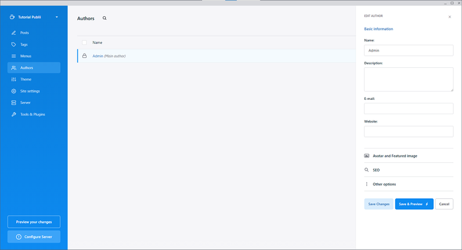

Di sini, Anda bisa menulis profil penulis.

Klik nama dari author yang ada di sana.

Nanti akan muncul sidebar di sebelah kanan.

Isilah profil author Anda di situ.

Setelah selesai, klik “Save Changes”.

#### Langkah 4

Masuklah ke tab “Tags”.

Nanti akan muncul tampilan seperti ini:

Saat pertama kali dibuka, daftar tag masih kosong.

Klik tombol “Add New Tag”

Sidebar kanan akan muncul.

Anda boleh mengisi “Name” dan “Description”.

Description akan tampil di bawah nama tag.

Nama tag akan muncul saat link dari tag dikunjungi.

Anda juga bisa mengisi slug tag dari bagian “SEO”.

Untuk menyimpan tag-nya, klik “Add New Tag” yang ada di kanan sidebar, kemudian klik “Save”.

Tags berguna untuk mengaitkan postingan. Jadi, satu tag bisa terdiri dari banyak postingan dan satu postingan bisa terdiri dari banyak tag.

Sebagai contoh, buatlah tag bernama “Blog”.

#### Langkah 5

Sekarang, kita akan membuat post pertama.

Masuklah ke tab “Posts”.

Nanti akan muncul tampilan seperti ini:

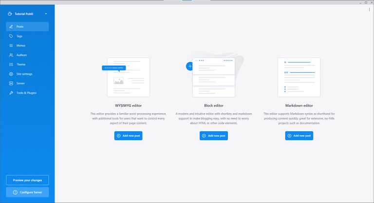

Saat ini, postingan masih kosong.

Selain itu, ada 3 pilihan untuk membuat post jika dilihat dari user interface post editornya:

-   Dengan WYSIWYG
-   Dengan Block
-   Dengan Markdown

Metode WYSIWYG bisa dianalogikan dengan editor yang seperti WordPress di versi lama.

Metode Block seperti WordPress di versi baru.

Metode Markdown menggunakan script Markdown yang Anda bisa pelajari di sumber lain.

Saat ini, gunakan metode WYSIWYG.

#### Langkah 6

Setelah Anda meng-klik “Add new post”, akan muncul tampilan editor WYSIWYG seperti gambar ini:

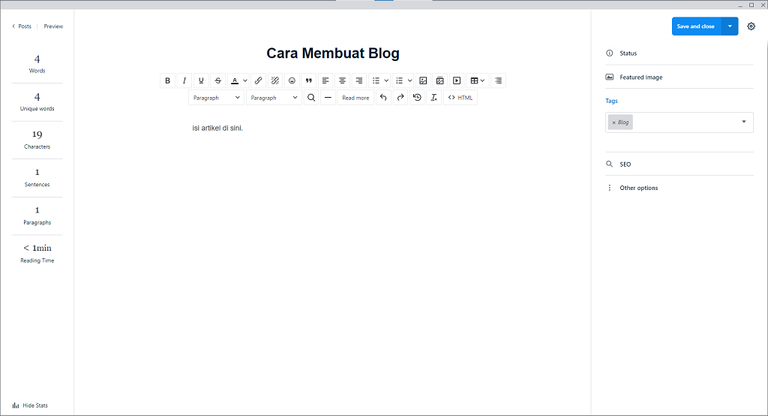

Anda bisa mengisi judul, isi, slug, meta description, thumbnail dan tag di situ.

Isi sesuka Anda, kemudian di bagian “Tags” di sidebar kanan, pilih tag bernama “Blog” yang telah Anda buat tadi.

Selanjutnya, klik “Save and Close”.

#### Langkah 7

Anda juga bisa membuat backup dari website Anda.

Caranya adalah dengan membuka tab “Tools & Plugins”, kemudian pilih “Backup”.

Selanjutnya klik “Create Backup”.

Seperti di gambar ini:

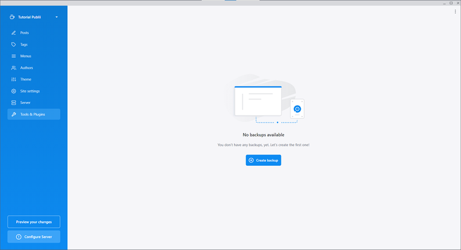

#### Langkah 8

Setelah postingan dibuat, kita akan membuat menu untuk navigasi.

Bukalah tab “Menus”.

Nanti akan muncul tampilan seperti gambar di bawah ini.

Klik “Add New Menu”.

Beri nama menu sesuai gambar di bawah ini:

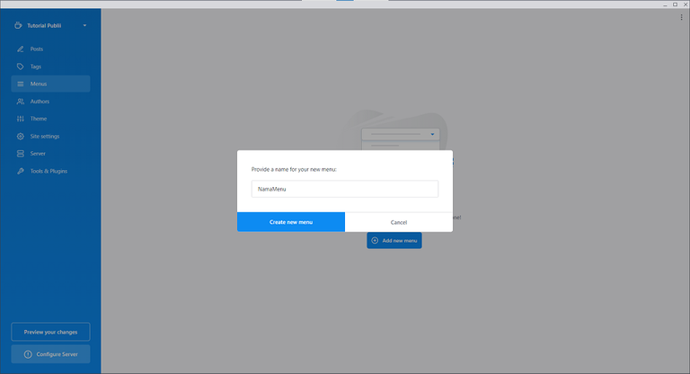

Selanjutnya, klik “Create New Menu”.

Nanti akan muncul tampilan seperti di gambar di bawah ini.

Di sini, assign ke “Main menu”.

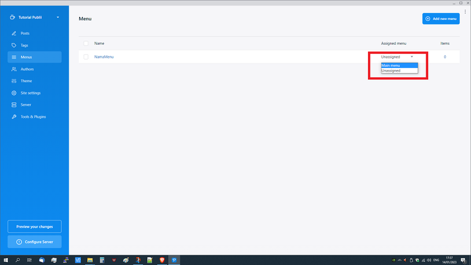

Selanjutnya, menu siap untuk di-edit.

Klik “Add Menu Item” dan isi seperti di gambar di bawah ini.

Selanjutnya, klik “Add Menu Item” di sidebar kanan.

Hasilnya seperti ini.

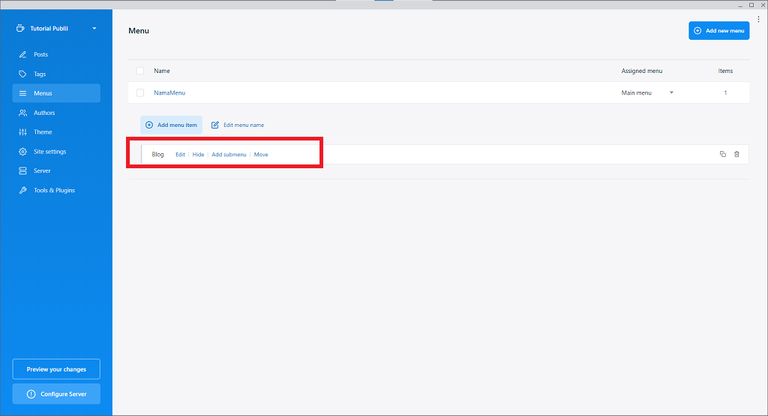

Sementara ini dulu langkah-langkah di sisi client.

Sekarang, di tab server, kita harus mengonfigurasi GitHub Pages terlebih dahulu.

### Langkah-Langkah di Sisi Server

#### Langkah 1

Masuklah ke akun GitHub Anda, lalu ke Settings > Developer Settings > Personal Access Token > Tokens (classic).

Di sana ada “Generate New Token (classic)”. Silakan diklik.

Gambarnya seperti ini:

Selanjutnya, isi seperti di gambar di bawah ini dan beri nama di bagian “Note”.

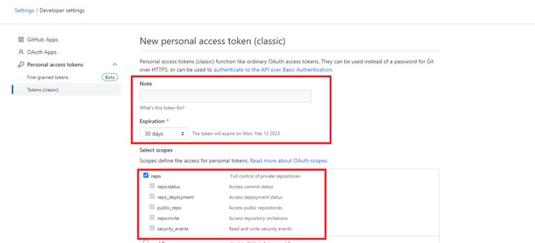

Pilih expiration-nya tanpa batas.

Centang “repo” dan di bawahnya.

Kemudian, klik “Generate Token”

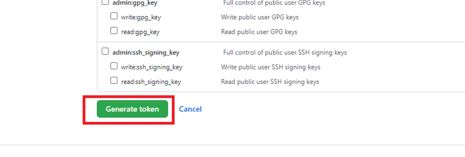

Copy dan simpan token itu baik-baik. Jangan hilang dan jangan diberikan ke pihak lain.

Karena, itulah yang akan kita inputkan ke tab server di client Publii Anda.

#### Langkah 2

Sekarang, kita akan membuat repository dengan nama khusus di akun GitHub.

Namun sebelumnya, kami akan sedikit cerita.

Jika pengguna GitHub membuat repository dengan nama “nama_akun.github.io”, maka isi dari repository tadi memiliki URL “https://nama_akun.github.io” yang bisa menampilkan isinya.

Dengan kata lain, jika kita mengisi repository itu dengan html, maka URL tadi bisa mengaksesnya.

Sekarang kita buat repository itu.

Buatlah repository baru bernama “nama_akun.github.io”.

Sesuaikan “nama_akun” dengan nama akun GitHub Anda.

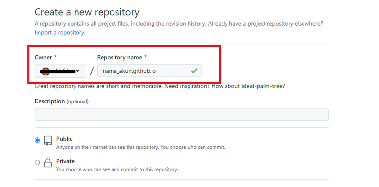

Jadikan repository itu “Public”.

Selanjutnya, kita akan kembali ke sisi client.

### Langkah-Langkah di Sisi Client yang Terakhir

Buka Publii kemudian buka tab “Server”.

Selanjutnya isi dengan detail di bawah ini:

-   Website URL: https://nama_akun.github.io
-   Username/Organization: nama_akun
-   Repository: nama_akun.github.io
-   Branch: main
-   Token: isi dengan token di GitHub settings yang sebelumnya telah Anda buat.

Gambarnya seperti ini:

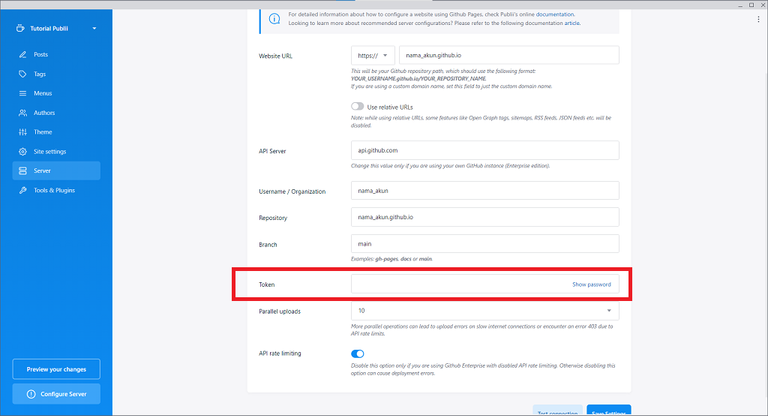

Kemudian, klik “Test Connection”.

Jika test connection berhasil, klik “Save Settings” lalu “Sync Your Website”.

Proses ini mungkin akan cukup lama, tergantung speed dari internet Anda.

Setelah selesai, mungkin akan memakan waktu juga hingga Anda bisa melihat hasilnya di: https://nama_akun.github.io.

## Jadi begitu caranya? Sekarang saya mengerti. Terima kasih…

Sama-sama.
