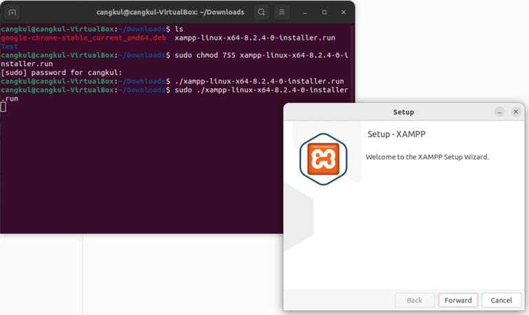
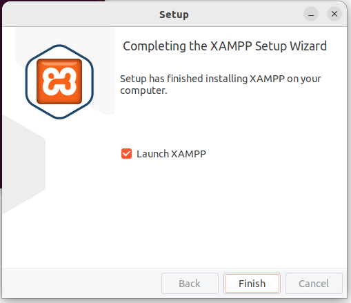
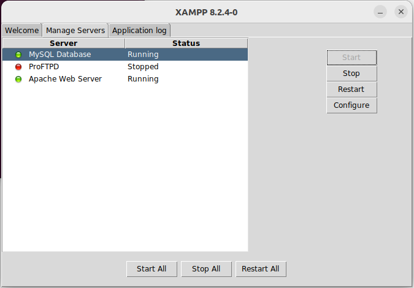

# Cara Menginstall XAMPP Di Ubuntu

## Mengenal Ubuntu

Ubuntu adalah sistem operasi berbasis Linux yang bersifat gratis dan open source.

Walaupun Ubuntu gratis, menurut saya kualitas dari sistem operasi tersebut sangat baik.

Saat ini, tampilan Ubuntu itu sendiri cukup user friendly.

Aplikasi gratisnya pun banyak dan beragam.

Salah satunya adalah XAMPP itu sendiri.

## Mengenal XAMPP

XAMPP adalah kumpulan aplikasi server web, server database, server FTP yang di-bundle menjadi satu dan dipermudah manajemennya dengan GUI.

XAMPP itu sendiri bersifat open source.

XAMPP menyediakan server lokal yang cukup lengkap untuk men-develop aplikasi web.

Singkatan "XAMPP" merujuk pada komponen utamanya, yaitu Apache (server web), MySQL (sistem manajemen database), PHP (bahasa pemrograman server-side), dan Perl.

Dengan XAMPP, pengembang dapat dengan mudah membuat dan menguji aplikasi web secara lokal pada komputer mereka sebelum mengunggahnya ke server web yang sebenarnya.

XAMPP mendukung beberapa sistem operasi termasuk Windows, macOS, dan Linux, menjadikannya pilihan populer di kalangan pengembang web yang memerlukan lingkungan pengembangan yang cepat dan mudah disiapkan.

## Alasan Mengapa Developer Web Menggunakan XAMPP

XAMPP umumnya digunakan oleh developer web yang menggunakan PHP dan MySQL untuk menjalankan aplikasinya secara lokal.

Di XAMPP, Apache, dengan PHP nya serta MySQL server nya sudah di-bundle, dan dipermudah manajemennya dengan GUI yang user friendly.

Berikut ini diberikan gambaran umum alasan penggunaan XAMPP:

-   Kemudahan Instalasi: XAMPP menyederhanakan proses instalasi dan konfigurasi server web lokal. Dengan sekali instalasi, pengembang dapat memiliki server Apache, MySQL, PHP, dan Perl yang siap digunakan.
-   Platform Independen: XAMPP tersedia untuk berbagai sistem operasi termasuk Windows, Mac OS, dan Linux, sehingga memungkinkan pengembang untuk bekerja di berbagai lingkungan.
-   Paket Terpadu: XAMPP menyatukan komponen-komponen penting seperti server web, database, dan bahasa pemrograman dalam satu paket. Ini membuatnya lebih mudah bagi pengembang untuk mengatur dan mengelola semua komponen yang dibutuhkan untuk pengembangan aplikasi web.
-   Cepat dan Efisien: Dengan XAMPP, pengembang dapat dengan cepat membuat server web lokal tanpa harus mengonfigurasi setiap komponen secara terpisah. Ini memungkinkan fokus lebih pada pengembangan aplikasi daripada pada konfigurasi server.
-   Pembaruan Mudah: XAMPP menyediakan pembaruan yang mudah dilakukan untuk komponen-komponennya. Pengembang dapat dengan cepat memperbarui versi Apache, MySQL, PHP, dan Perl tanpa harus melakukan banyak konfigurasi tambahan.
-   Pemisahan Lingkungan Pengembangan: Dengan menggunakan XAMPP, pengembang dapat menciptakan dan menguji aplikasi web secara lokal sebelum menerapkannya ke server produksi. Ini membantu mengurangi risiko kesalahan dan memungkinkan pengembang untuk melakukan debug dengan lebih efisien.

## Sistem Operasi yang Didukung XAMPP

Anda bisa menggunakan XAMPP di Windows, Mac OS, dan Linux.

Kami sendiri menggunakannya di Windows.

Hanya saja, dalam artikel ini, saya membahas peng-install-an XAMPP di Ubuntu.

Menurut saya, asalkan kita tahu caranya, cara meng-install XAMPP tidak terlalu sulit.

Cukup dengan beberapa perintah dan dialog dengan installer-nya.

## Langkah-Langkah Peng-install-an XAMPP di Ubuntu

Sekarang, saya akan membahas langkah-langkah peng-install-an XAMPP di Ubuntu.

Pertama, download XAMPP untuk linux di:

https://sourceforge.net/projects/xampp/files/XAMPP%20Linux/8.2.4/xampp-linux-x64-8.2.4-0-installer.run

Jika Anda ingin versi lainnya, dapatkan di:

https://www.apachefriends.org/download.html

Setelah selesai download, buka terminal dan masuklah ke folder download-nya.

Selanjutnya, jalankan (sesuaikan dengan nama file yang Anda download):

```
sudo chmod 755 xampp-linux-x64-8.2.4-0-installer.run
```

Agar installer-nya bisa di-execute.

Selanjutnya, jalankan (sesuaikan dengan nama file yang Anda download):

```
sudo ./xampp-linux-x64-8.2.4-0-installer.run
```

Nanti akan muncul dialog seperti ini:



Cukup tekan tombol “Forward” atau “Finish” dari mulai hingga selesai.

Berdasarkan pengalaman kami, peng-install-an cukup memakan waktu dan terkadang terkesan seperti hang.

Jika demikian, tunggu saja dan jangan batalkan peng-install-an.

Tampilan akhir dialog akan seperti ini:



Di sini, Anda bisa memilih untuk menjalankan XAMPP atau tidak.

Jika ya, maka akan muncul tampilan ini jika Anda masuk ke tab “Manage Servers”:



Di situ, Anda bisa start, stop, restart, dan configure servernya.

Sekarang, setelah Anda menutup dialog tersebut, mungkin Anda akan bertanya: Bagaimana cara menjalankan XAMPP untuk kedua kali dan seterusnya?

Karena, di launcher, Anda tidak bisa menemukan XAMPP.

Caranya, kita harus menjalankannya via terminal.

Pertama, masuk ke folder “/opt/lampp”:

```
cd /opt/lampp
```

Kemudian, jalankan:

```
sudo ./manager-linux-x64.run
```

Nanti, dialog XAMPP akan muncul lagi.

Bagaimana, mudah bukan?

## Lokasi Folder htdocs

Sekarang, Anda tinggal meletakkan file script PHP Anda di folder htdocs dari XAMPP.

Sepertinya, di folder “/opt/lampp” ada folder htdocs.

Jika ada, di situlah tempat Anda menempatkan file script PHP Anda.

## Penutup

Setelah XAMPP ter-install, coba script PHP Anda di folder htdocs tadi dan pastikan server-nya sudah dijalankan.

Lalu, lihat respon script tersebut melalui web browser Anda.
